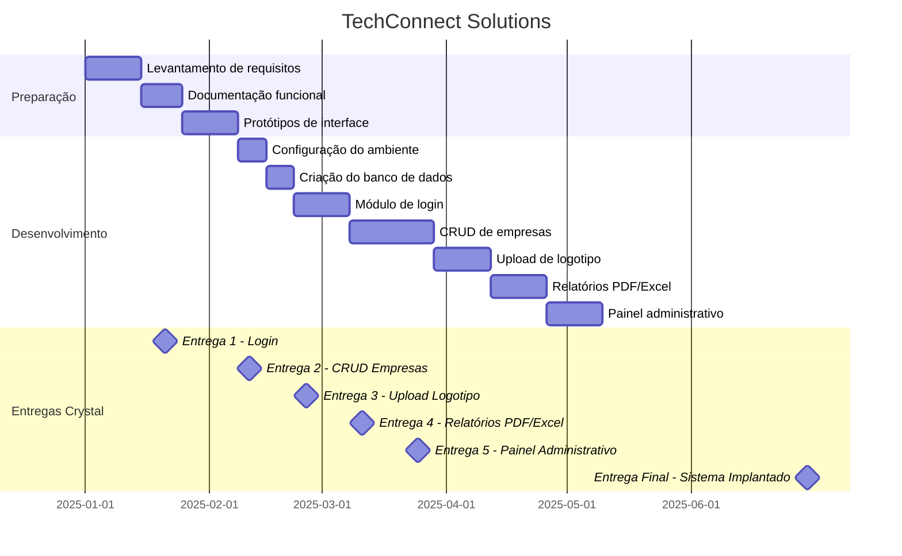

# att-avaliativa-gantt



#Grafico crystal

```mermaid
graph TD
 E1["Levantamento de Requisitos - Semana 1 - E"]:::branco
 E2["Documentação Funcional - Semana 2 - E"]:::branco
 E3["Layout do Sistema - Semana 2 - C"]:::branco
 E4["Entrega 1 - Login - Semana 3 - E"]:::branco
 E5["Entrega 2 - CRUD - Semana 6 - C"]:::amarelo
 E6["Entrega 3 - Upload - Semana 8 - C"]:::laranja
 E7["Entrega 4 - Relatórios - Semana 10 - E"]:::laranja
 E8["Entrega 5 - Painel Admin - Semana 12 - D"]:::vermelho
 E9["Entrega Final - Sistema Completo - Semana 24 - V"]:::vermelho

 E1 --> E2 --> E3 --> E4 --> E5 --> E6 --> E7 --> E8 --> E9

%% Definições de estilo
classDef branco fill:#ffffff,stroke:#000,stroke-width:1px;
classDef amarelo fill:#FFD80D,stroke:#000,stroke-width:1px;
classDef laranja fill:#FFA233,stroke:#000,stroke-width:1px;
classDef vermelho fill:#E64C3C,stroke:#000,stroke-width:1px;
